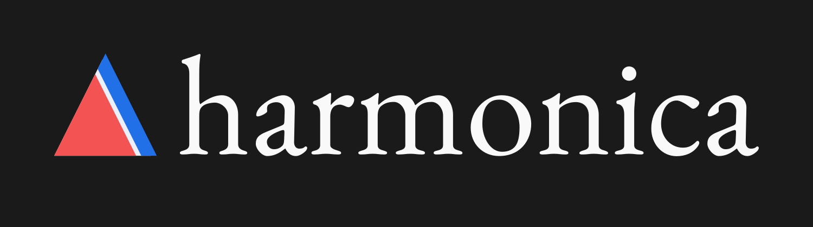

.. title:: Home

========
|banner|
========

.. admonition:: This software is in the early stages of design and implementation
    :class: attention

    This means that will occasionally make **backwards incompatible** changes
    as we try to improve the software, test new ideas, and settle on the
    project scope.
    **We welcome any feedback and ideas!** Let us know by submitting
    `issues on Github <https://github.com/fatiando/harmonica/issues>`__
    or send us a message on our
    `Slack chatroom <http://contact.fatiando.org>`__.

.. seealso::

    Harmonica is a part of the
    `Fatiando a Terra <https://www.fatiando.org/>`_ project.

.. include:: ../README.rst
    :start-after: placeholder-for-doc-index

.. toctree::
    :maxdepth: 2
    :hidden:
    :caption: Getting Started

    install.rst
    citing.rst
    gallery/index.rst

.. toctree::
    :maxdepth: 2
    :hidden:
    :caption: User Guide

    sample_data/index.rst

.. toctree::
    :maxdepth: 2
    :hidden:
    :caption: Reference documentation

    api/index.rst
    changes.rst
    references.rst

.. toctree::
    :maxdepth: 2
    :hidden:
    :caption: Getting help and contributing

    Join the community <http://contact.fatiando.org>
    How to contribute <https://github.com/fatiando/harmonica/blob/main/CONTRIBUTING.md>
    Code of Conduct <https://github.com/fatiando/community/blob/main/CODE_OF_CONDUCT.md>
    Source code on GitHub <https://github.com/fatiando/harmonica>
    The Fatiando a Terra project <https://www.fatiando.org>
