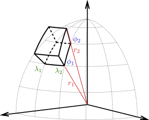

.. _tesseroid:

Tesseroids
==========

When our region of interest covers several longitude and latitude degrees,
utilizing Cartesian coordinates to model geological structures might
introduce significant errors: they don't take into account the curvature of the
Earth. Instead, we would need to work in :ref:`spherical_coordinates`.
A common approach to forward model bodies in geocentric spherical coordinates
is to make use of tesseroids.

A tesseroid (a.k.a spherical prism) is a three dimensional body defined by the
volume contained by two longitudinal boundaries, two latitudinal boundaries and
the surfaces of two concentric spheres of different radii (see :ref:`tesseroid
figure`).

   Figure: Tesseroid

   Tesseroid defined by two longitude coordinates (:math:`\lambda_1` and
   :math:`\lambda_2`), two latitude coordinates (:math:`\phi_1` and
   :math:`\phi_2`) and the surfaces of two concentric spheres of radii
   :math:`r_1` and :math:`r_2`.
   This figure is a modified version of [Uieda2015]_.

Through the :func:`harmonica.tesseroid_gravity` function we can calculate the
gravitational field of any tesseroid with a given density on any computation
point. Each tesseroid can be represented through a tuple containing its six
boundaries in the following order: *west*, *east*, *south*, *north*, *bottom*,
*top*, where the former four are its longitudinal and latitudinal boundaries in
decimal degrees and the latter two are the two radii given in meters.

.. note::

   The :func:`harmonica.tesseroid_gravity` numerically computed the
   gravitational fields of tesseroids by applying a method that applies the
   Gauss-Legendre Quadrature along with a bidimensional adaptive discretization
   algorithm. Refer to [Soler2019]_ for more details.

Lets define a single tesseroid and compute the gravitational potential
it generates on a regular grid of computation points located at 10 km  above
its *top* boundary.

Get the WGS84 reference ellipsoid from :mod:`boule` so we can obtain its mean
radius:

.. jupyter-execute::

   import boule as bl

   ellipsoid = bl.WGS84
   mean_radius = ellipsoid.mean_radius

Define the tesseroid and its density (in kg per cubic meters):

.. jupyter-execute::

   tesseroid = (-70, -50, -40, -20, mean_radius - 10e3, mean_radius)
   density = 2670

Define a set of computation points located on a regular grid at 100 km above
the *top* surface of the tesseroid:

.. jupyter-execute::

   import verde as vd

   coordinates = vd.grid_coordinates(
       region=[-80, -40, -50, -10],
       shape=(80, 80),
       extra_coords=100e3 + mean_radius,
   )

Lets compute the *downward* component of the gravitational acceleration it
generates on the computation point:

.. jupyter-execute::

   import harmonica as hm

   gravity = hm.tesseroid_gravity(coordinates, tesseroid, density, field="g_z")

.. important::

   The *downward* component :math:`g_z` of the gravitational acceleration
   computed in spherical coordinates corresponds to :math:`-g_r`, where
   :math:`g_r` is the
   radial component.

And finally plot the computed gravitational field

.. jupyter-execute::

   import pygmt
   grid = vd.make_xarray_grid(
      coordinates, gravity, data_names="gravity", extra_coords_names="extra")

   fig = pygmt.Figure()
   title = "Downward component of gravitational acceleration"
   with pygmt.config(FONT_TITLE="12p"):
      fig.grdimage(
         region=[-80, -40, -50, -10],
         projection="M-60/-30/10c",
         grid=grid.gravity,
         frame=["a", f"+t{title}"],
         cmap="viridis",
      )

   fig.colorbar(cmap=True, frame=["a200f50", "x+lmGal"])
   fig.coast(shorelines="1p,black")

   fig.show()

Multiple tesseroids
-------------------

We can compute the gravitational field of a set of tesseroids by passing a list
of them, where each tesseroid is defined as mentioned before, and then making
a single call of the :func:`harmonica.tesseroid_gravity` function.

Lets define a set of four prisms along with their densities:

.. jupyter-execute::

   tesseroids = [
       [-70, -65, -40, -35, mean_radius - 100e3, mean_radius],
       [-55, -50, -40, -35, mean_radius - 100e3, mean_radius],
       [-70, -65, -25, -20, mean_radius - 100e3, mean_radius],
       [-55, -50, -25, -20, mean_radius - 100e3, mean_radius],
   ]
   densities = [2670 , 2670, 2670, 2670]

Compute their gravitational effect on a grid of computation points:

.. jupyter-execute::

   coordinates = vd.grid_coordinates(
       region=[-80, -40, -50, -10],
       shape=(80, 80),
       extra_coords=100e3 + mean_radius,
   )
   gravity = hm.tesseroid_gravity(coordinates, tesseroids, densities, field="g_z")

And plot the results:

.. jupyter-execute::

   grid = vd.make_xarray_grid(
      coordinates, gravity, data_names="gravity", extra_coords_names="extra")

   fig = pygmt.Figure()
   title = "Downward component of gravitational acceleration"
   with pygmt.config(FONT_TITLE="12p"):
      fig.grdimage(
         region=[-80, -40, -50, -10],
         projection="M-60/-30/10c",
         grid=grid.gravity,
         frame=["a", f"+t{title}"],
         cmap="viridis",
      )

   fig.colorbar(cmap=True, frame=["a1000f500", "x+lmGal"])
   fig.coast(shorelines="1p,black")

   fig.show()

Tesseroids with variable density
--------------------------------

The :func:`harmonica.tesseroid_gravity` is capable of computing the
gravitational effects of tesseroids whose density is defined through
a continuous function of the radial coordinate. This is achieved by the
application of the method introduced in [Soler2021]_.

To do so we need to define a regular Python function for the density, which
should have a single argument (the ``radius`` coordinate) and return the
density of the tesseroids at that radial coordinate.
In addition, we need to decorate the density function with
:func:`numba.jit(nopython=True)` or ``numba.njit`` for short.

Lets compute the gravitational effect of four tesseroids whose densities are
given by a custom linear ``density`` function.

Start by defining the tesseroids

.. jupyter-execute::

   tesseroids = (
       [-70, -60, -40, -30, mean_radius - 3e3, mean_radius],
       [-70, -60, -30, -20, mean_radius - 5e3, mean_radius],
       [-60, -50, -40, -30, mean_radius - 7e3, mean_radius],
       [-60, -50, -30, -20, mean_radius - 10e3, mean_radius],
   )

Then, define a linear density function. We need to use the ``jit`` decorator so
Numba can run the forward model efficiently.

.. jupyter-execute::

   from numba import njit

   @njit
   def density(radius):
       """Linear density function"""
       top = mean_radius
       bottom = mean_radius - 10e3
       density_top = 2670
       density_bottom = 3000
       slope = (density_top - density_bottom) / (top - bottom)
       return slope * (radius - bottom) + density_bottom

Lets create a set of computation points located on a regular grid at 100km
above the mean Earth radius:

.. jupyter-execute::

   coordinates = vd.grid_coordinates(
       region=[-80, -40, -50, -10],
       shape=(80, 80),
       extra_coords=100e3 + ellipsoid.mean_radius,
   )

And compute the gravitational fields the tesseroids generate:

.. jupyter-execute::

   gravity = hm.tesseroid_gravity(coordinates, tesseroids, density, field="g_z")

Finally, lets plot it:

.. jupyter-execute::

   grid = vd.make_xarray_grid(
      coordinates, gravity, data_names="gravity", extra_coords_names="extra")

   fig = pygmt.Figure()
   title = "Downward component of gravitational acceleration"
   with pygmt.config(FONT_TITLE="12p"):
      fig.grdimage(
         region=[-80, -40, -50, -10],
         projection="M-60/-30/10c",
         grid=grid.gravity,
         frame=["a", f"+t{title}"],
         cmap="viridis",
      )

   fig.colorbar(cmap=True, frame=["a200f100", "x+lmGal"])
   fig.coast(shorelines="1p,black")

   fig.show()

----

.. grid:: 2

    .. grid-item-card:: :jupyter-download-script:`Download Python script <tesseroid>`
        :text-align: center

    .. grid-item-card:: :jupyter-download-nb:`Download Jupyter notebook <tesseroid>`
        :text-align: center
